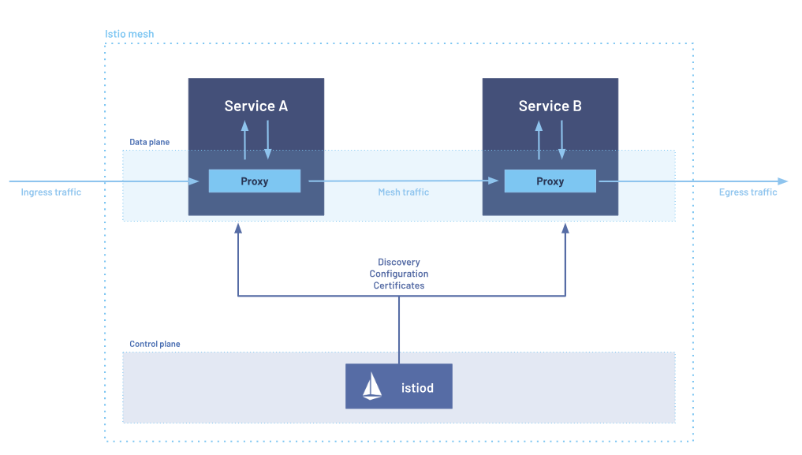

# Istio
Follow along [YouTube series](https://www.youtube.com/playlist?list=PL8klaCXyIuQ5wFRbjOZwxeLq2_wJqjani)

## Introduction
Istio is an open-source service mesh platform that provides a way to manage and secure communication between microservices in a distributed application. It acts as a layer on top of the network infrastructure, offering advanced traffic management, security, and observability features without requiring changes to the application code.

Key features of Istio include:

1. **Traffic Management**: Istio allows fine-grained control over traffic behavior, including routing, load balancing, and failover. It supports advanced policies like A/B testing, canary releases, and circuit breaking.

2. **Security**: Istio provides robust security features such as mutual TLS (mTLS) for secure service-to-service communication, authentication, and authorization. It helps enforce policies to protect services from vulnerabilities.

3. **Observability**: Istio offers tools for monitoring and observing the health of microservices, including metrics, distributed tracing, and logging. This helps in diagnosing issues and understanding system behavior.

4. **Policy Enforcement**: Istio enables the definition and enforcement of policies for access control, rate limiting, and quotas, helping ensure compliance and resource management.

5. **Service Discovery and Load Balancing**: Istio integrates with service discovery mechanisms to route traffic based on service availability and health, improving system resilience and reliability.

Istio achieves these capabilities by deploying sidecar proxies (usually Envoy) alongside each service in the mesh. These proxies intercept and manage all network traffic between services, applying the desired policies and configurations.

### Architecture
Sidecar mode


## Installation and setup

### Cluster Setup
Start minikube cluster
```sh
minikube start --driver=docker --memory=4096 --cpus=4
```
### (Optional) Install Metrics server and Skooner dashboard
Install metrics server and Skooner dashboard
```sh
kubectl apply -f kubernetes-dashboard/metrics-server.yaml
kubectl apply -f kubernetes-dashboard/skooner_dashboard.yml
```
Get service account token to access skooner dashboard
```sh
kubectl create token skooner-sa -n default
```

### Install Istio
Istio can be downloaded from release page or via `curl` commands
- https://istio.io/latest/about/faq/#install-method-selection
- https://istio.io/latest/docs/setup/getting-started/#download

### Test setup
Install Istio demo profile without gateways and enable sidecar injection
```sh
istioctl install -f samples/bookinfo/demo-profile-no-gateways.yaml -y
kubectl label namespace default istio-injection=enabled
```
Install the Kubernetes [Gateway API](https://gateway-api.sigs.k8s.io/) CRDs
```sh
kubectl get crd gateways.gateway.networking.k8s.io &> /dev/null || \
{ kubectl kustomize "github.com/kubernetes-sigs/gateway-api/config/crd?ref=v1.1.0" | kubectl apply -f -; }
```
Check CRDs
```sh
$ kubectl get crds
NAME                                        CREATED AT
authorizationpolicies.security.istio.io     2024-08-03T14:21:56Z
destinationrules.networking.istio.io        2024-08-03T14:21:56Z
envoyfilters.networking.istio.io            2024-08-03T14:21:56Z
gatewayclasses.gateway.networking.k8s.io    2024-08-03T14:24:22Z
gateways.gateway.networking.k8s.io          2024-08-03T14:24:22Z
gateways.networking.istio.io                2024-08-03T14:21:56Z
grpcroutes.gateway.networking.k8s.io        2024-08-03T14:24:22Z
httproutes.gateway.networking.k8s.io        2024-08-03T14:24:23Z
peerauthentications.security.istio.io       2024-08-03T14:21:56Z
proxyconfigs.networking.istio.io            2024-08-03T14:21:56Z
referencegrants.gateway.networking.k8s.io   2024-08-03T14:24:23Z
requestauthentications.security.istio.io    2024-08-03T14:21:56Z
serviceentries.networking.istio.io          2024-08-03T14:21:56Z
sidecars.networking.istio.io                2024-08-03T14:21:56Z
telemetries.telemetry.istio.io              2024-08-03T14:21:56Z
virtualservices.networking.istio.io         2024-08-03T14:21:56Z
wasmplugins.extensions.istio.io             2024-08-03T14:21:56Z
workloadentries.networking.istio.io         2024-08-03T14:21:56Z
workloadgroups.networking.istio.io          2024-08-03T14:21:56Z
```
Deploy the sample application
```sh
kubectl apply -f samples/bookinfo/platform/kube/bookinfo.yaml
kubectl get po,svc,sa
```
Validate the application
```
kubectl exec "$(kubectl get pod -l app=ratings -o jsonpath='{.items[0].metadata.name}')" -c ratings -- curl -sS productpage:9080/productpage | grep -o "<title>.*</title>"
```
### Create a Kubernetes Gateway for the Bookinfo application:
```sh
kubectl apply -f samples/bookinfo/gateway-api/bookinfo-gateway.yaml
kubectl get gateway
```
### Access the application
Open your browser and navigate to http://localhost:80/productpage to view the Bookinfo application.
If you refresh the page, you should see the book reviews and ratings changing as the requests are distributed across the different versions of the reviews service.

### Deploy Kiali, Prometheus, Grafana, and Jaeger dashboards
Istio integrates with several different telemetry applications. These can help you gain an understanding of the structure of your service mesh, display the topology of the mesh, and analyze the health of your mesh.
```sh
kubectl apply -f samples/addons
kubectl rollout status deployment/kiali -n istio-system
```
Access the Kiali dashboard.
```sh
istioctl dashboard kiali
```
In the left navigation menu, select Graph and in the Namespace drop down, select default.
To see trace data, you must send requests to your service. The number of requests depends on Istio’s sampling rate and can be configured using the Telemetry API. With the default sampling rate of 1%, you need to send at least 100 requests before the first trace is visible. To send 100 requests to the productpage service, use the following command:
```sh
for i in $(seq 1 100); do curl -s -o /dev/null "http://$GATEWAY_URL/productpage"; done
```
The Kiali dashboard shows an overview of your mesh with the relationships between the services in the Bookinfo sample application. It also provides filters to visualize the traffic flow.

### Uninstall BookInfo application
To delete the Bookinfo sample application, run below shell script and also remove the addons
```sh
samples/bookinfo/platform/kube/cleanup.sh
kubectl delete -f samples/addons
```
The Istio uninstall deletes the RBAC permissions and all resources hierarchically under the istio-system namespace. It is safe to ignore errors for non-existent resources because they may have been deleted hierarchically.
```sh
istioctl uninstall -y --purge
kubectl delete namespace istio-system
kubectl label namespace default istio-injection-
```

## Working with Istio Profiles
Get profiles list
```sh
istioctl profile list
```
Extract configurations that can run only with istioctl
```sh
istioctl profile dump default > default_profile.yml 
kubectl apply -f default_profile.yml
istioctl apply -f default_profile.yml
```
Install a specific profiles. Default is `default` profiles
```sh
istioctl install 
istioctl install --set profile=demo -y
istioctl verify-install
```
Extract configurations that can run with kubectl
```sh
istioctl manifest generate --set profile=demo > istio-installation.yaml
kubectl apply -f istio-installation.yaml
```
Verify  if all objects/resources are deployed
```sh
istioctl verify-install -f istio-installation.yaml
kubectl get all -n istio-system
```
Analyze the setup
```sh
istioctl analyze
```
Uninstall
```sh
istioctl uninstall --purge
```

## References
- Architecture v1.4: https://istio.io/v1.4/docs/ops/deployment/architecture
- Architecture(latest): https://istio.io/latest/docs/ops/deployment/architecture/
- Distributed tracing: https://istio.io/latest/docs/tasks/observability/distributed-tracing/overview/
- Gateway API: https://gateway-api.sigs.k8s.io/
- Sidecar mode: https://istio.io/latest/docs/setup/getting-started/
- Ambient mode: https://www.cncf.io/blog/2024/03/19/istio-announces-the-beta-release-of-ambient-mode/
- BookInfo app: https://istio.io/latest/docs/examples/bookinfo/
- Gateway API tasks: https://istio.io/latest/docs/tasks/traffic-management/ingress/gateway-api/